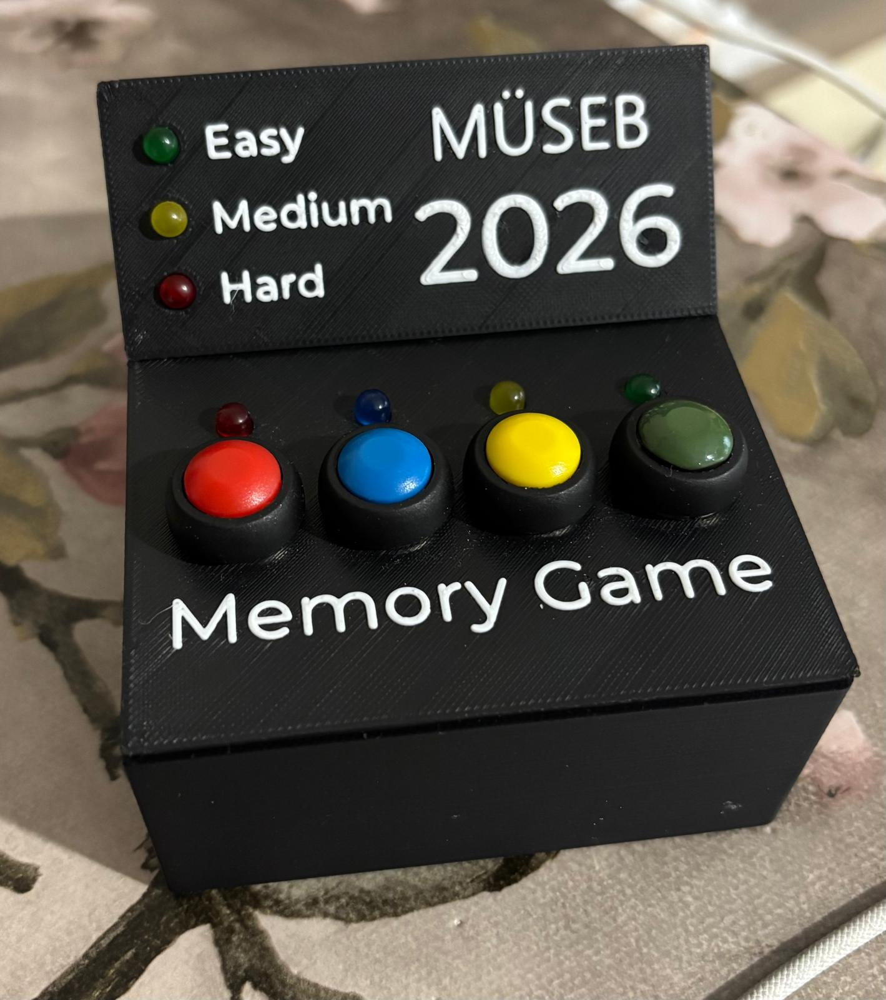
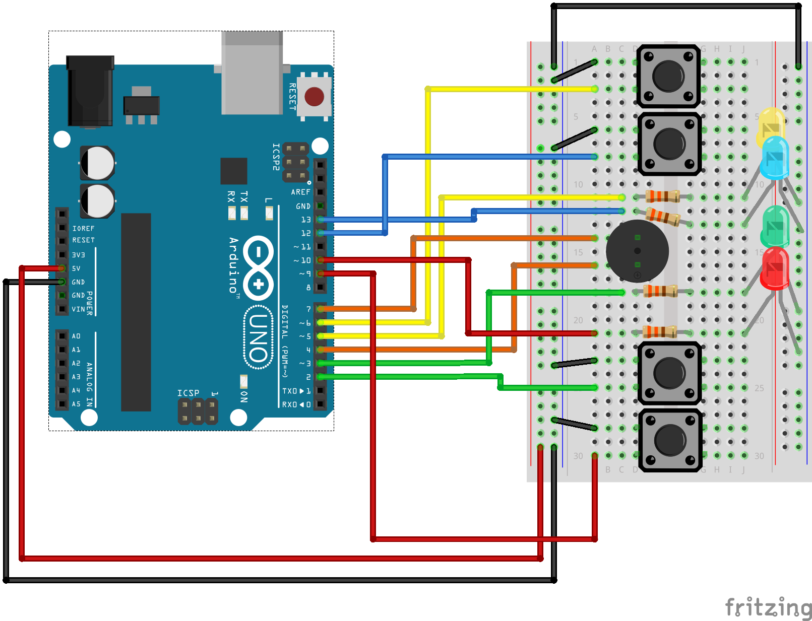
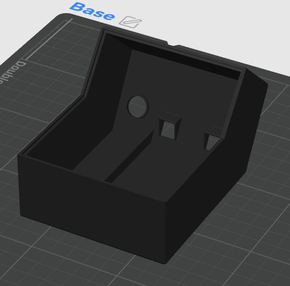
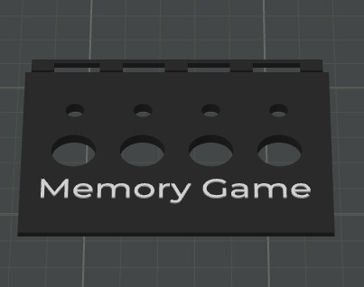
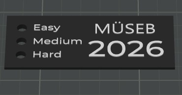

# Simon Says Memory Game

This project is an Arduino Uno based **Simon Says memory game**.  
The aim of the game is to test the player's memory by showing a color sequence and asking the player to repeat the same sequence correctly using colored buttons.

The game includes three main difficulty modes:

- Easy
- Medium
- Hard

Each difficulty mode contains **3 levels**. As the player progresses through the levels, the game becomes more challenging.

---

## Final Product

The final version of the game was assembled inside a custom 3D-printed enclosure.



---

## Project Overview

The game uses four colored buttons:

- Red
- Blue
- Yellow
- Green

The system generates a color sequence. The player must repeat this sequence by pressing the correct buttons in the correct order. If the player enters the sequence correctly, the game continues to the next level. If the player makes a mistake, the game resets or ends depending on the game logic.

This project combines Arduino programming, circuit design, button-based user interaction, game logic, and 3D-printed product assembly.

---

## Game Modes and Levels

| Difficulty Mode | Levels |
|---|---|
| Easy | Level 1, Level 2, Level 3 |
| Medium | Level 1, Level 2, Level 3 |
| Hard | Level 1, Level 2, Level 3 |

Each mode has its own level structure. The game becomes more difficult as the player moves from Easy to Medium and Hard.

---

## Hardware Components

The project was built using the following components:

- Arduino Uno
- 4 push buttons
- Red, blue, yellow, and green button layout
- Jumper wires
- Breadboard or circuit board
- Custom 3D-printed enclosure
- Power connection for Arduino Uno

---

## Circuit Schematic

The circuit schematic of the project is shown below.



---

## Arduino Code

The Arduino source code is included in the `src` folder.

Main code file:

`src/simon_says_game.ino`

The Arduino code handles:

- Button input reading
- Color sequence generation
- Difficulty mode control
- Level progression
- User input checking
- Correct and incorrect answer logic
- Game reset operation

---

## 3D Printed Enclosure

The game has a custom 3D-printed enclosure.  
The enclosure consists of three main parts:

- Base
- Bottom Cover
- Top Cover

The enclosure design was created by **Ayşe Sude Cengiz**.  
The case was 3D printed and the electronic circuit was placed inside the enclosure.

---

## Enclosure Parts

### Base



### Bottom Cover



### Top Cover



The 3D model files are located in the `3d-models` folder.

---

## Repository Structure

```text
Simon-Says-Memory-Game/
│
├── README.md
│
├── src/
│   └── simon_says_game.ino
│
├── images/
│   ├── final-product.jpg
│   ├── circuit-schematic.png
│   ├── base.jpg
│   ├── bottom-cover.jpg
│   └── top-cover.jpg
│
└── 3d-models/
    ├── base.stl
    ├── bottom-cover.stl
    └── top-cover.stl
